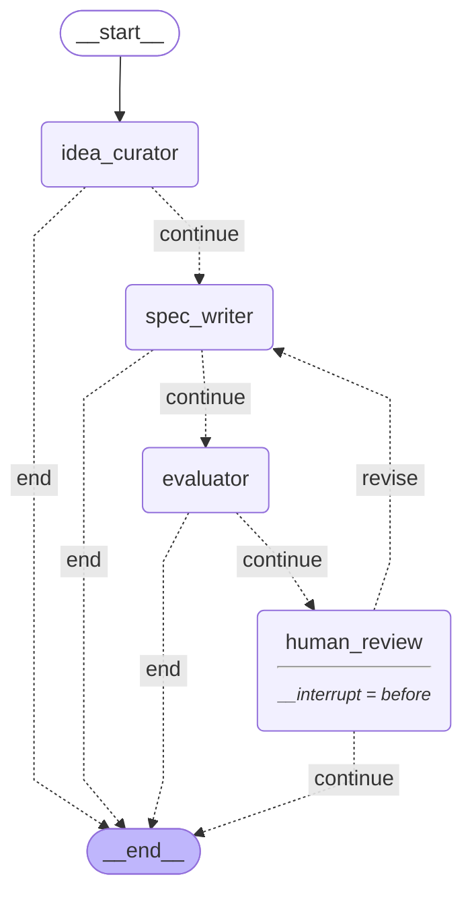

# make_it_real

Multi-agent end user application with modern chatbot UI to structure ideas for apps, prepare them technically and work out a structured plan to systematically implement a first, functional prototype.

## Configuration

Copy `.env_example` to `.env` and specify your OpenAI API key as value of `OPENAI_API_KEY`.

Similarly, copy `.mcp.env_example` to `.mcp.env` and replace `PAT` with your personal GitHub access token.

## Run

To build and run containerized CLI:
```sh
make run IDEA='task management app for developers'
```

## Graph

To dump the LangGraph mermaid, run:
```sh
make dump-graph
```

