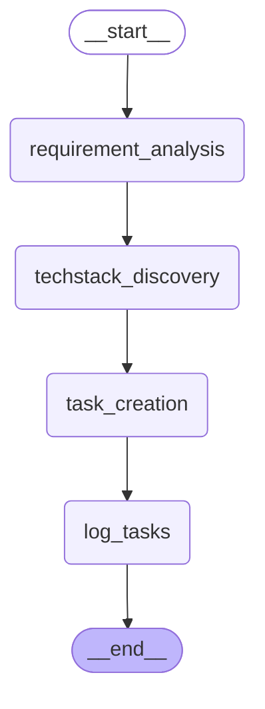

# make_it_real

A multi-agent CLI to flesh out project ideas.

AI agents derive use-cases, a tech stack as well as tasks from a given idea, letting the user confirm each (human-in-the-loop) after it was successfully reviewed by another AI agent.

It is written in Python using the LangChain and LangGraph frameworks.

## Environment setup

To run the containerized CLI, you need to have `make` and [docker](https://docs.docker.com/engine/install/) installed.

### Configuration

Copy `.env_example` to `.env` and specify your OpenAI API key as value of `OPENAI_API_KEY`.

## Run

To build and run the containerized CLI:
```sh
make run IDEA='task management app for developers'
```

## Graph of the AI workflow

To dump the LangGraph mermaid diagram, run:
```sh
make dump-graph
```

Main graph of the AI workflow (top-level; the nodes `requirements_analysis`, `techstack_discovery`, `task_creation` are actually sub graphs):

Sub graph (used within each `requirements_analysis`, `techstack_discovery`, `task_creation` in the graph above)

