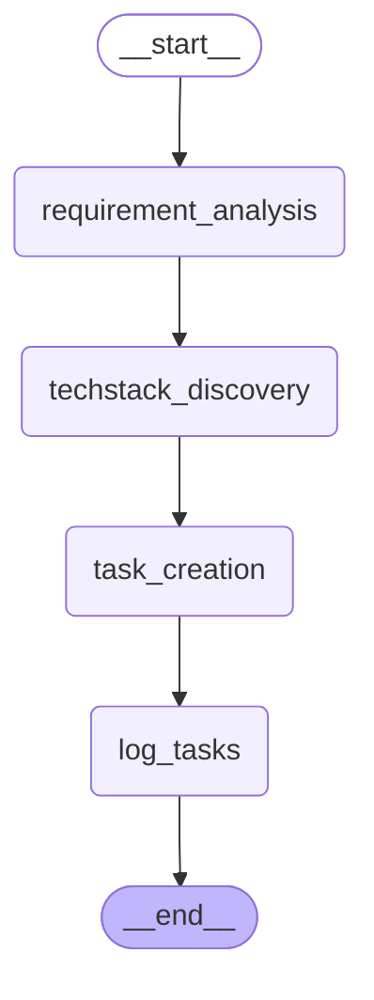
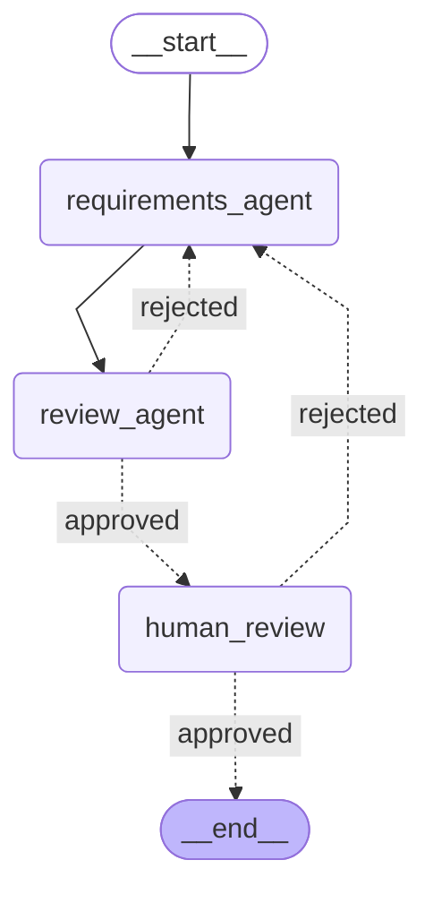

Main Graph

```mermaid
---
config:
  flowchart:
    curve: linear
---
graph TD;
	__start__([<p>__start__</p>]):::first
	requirement_analysis(requirement_analysis)
	techstack_discovery(techstack_discovery)
	task_creation(task_creation)
	log_tasks(log_tasks)
	__end__([<p>__end__</p>]):::last
	__start__ --> requirement_analysis;
	requirement_analysis --> techstack_discovery;
	task_creation --> log_tasks;
	techstack_discovery --> task_creation;
	log_tasks --> __end__;
	classDef default fill:#f2f0ff,line-height:1.2
	classDef first fill-opacity:0
	classDef last fill:#bfb6fc

```
Sub Graph

```mermaid
---
config:
  flowchart:
    curve: linear
---
graph TD;
	__start__([<p>__start__</p>]):::first
	requirements_agent(requirements_agent)
	review_agent(review_agent)
	human_review(human_review)
	__end__([<p>__end__</p>]):::last
	__start__ --> requirements_agent;
	human_review -. &nbsp;approved&nbsp; .-> __end__;
	human_review -. &nbsp;rejected&nbsp; .-> requirements_agent;
	requirements_agent --> review_agent;
	review_agent -. &nbsp;approved&nbsp; .-> human_review;
	review_agent -. &nbsp;rejected&nbsp; .-> requirements_agent;
	classDef default fill:#f2f0ff,line-height:1.2
	classDef first fill-opacity:0
	classDef last fill:#bfb6fc

```
